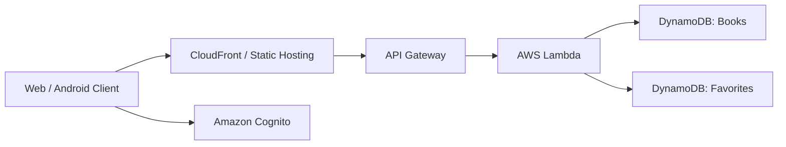

# Architecture

## Summary

このアプリは、Web / Android クライアントから同一の API を利用する書籍管理プラットフォームです。公開検索は認証なしで利用でき、認証済みユーザーはお気に入り管理、管理者は蔵書の追加・削除を行えます。

## System Flow

## Key Responsibilities

| Component | Responsibility |
| --- | --- |
| Web / Android | 検索、認証状態の保持、お気に入り操作、管理 UI |
| Amazon Cognito | ログイン、トークン発行、管理者グループ判定 |
| API Gateway | REST API 公開、認証済みリクエストの受け口 |
| AWS Lambda | 検索 API、お気に入り API、管理 API |
| DynamoDB | 書籍データとユーザーお気に入りの永続化 |
| Terraform | 環境別の AWS リソース定義 |

## Functional Scope

- 書籍一覧取得
- タイトル検索 / 著者検索
- お気に入り一覧取得
- お気に入り追加 / 削除
- 管理者による書籍追加 / 削除

## Design Notes

- Web 側はシンプルな JavaScript 構成に寄せ、DOM を直接組み立てる実装で XSS リスクを抑えています。
- Android 側は Cognito トークンをローカル保存し、API 呼び出し時に `Authorization` ヘッダーへ付与します。
- インフラコードは `infra/modules` に共通化し、`infra/live/*` から各環境を組み立てる構成です。
